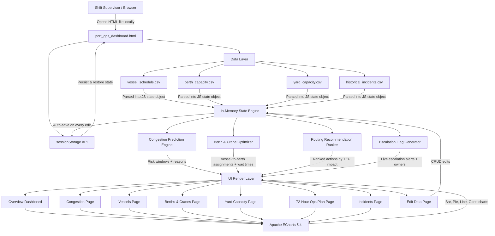

# Architecture

## System Architecture

[Describe the overall architecture of your system. Replace the Mermaid diagram below with your actual architecture.]

## Components

| Component | Technology | Responsibility |
|---|---|---|
| Frontend | Vanilla HTML5 / CSS3 / JavaScript ES2020 | Full dashboard UI, all user interaction, navigation, CRUD forms, chart rendering |
| Backend API | None — fully client-side | All business logic runs in-browser via pure JavaScript functions |
| AI / ML | IBM Bob (AI Copilot platform) | Congestion prediction reasoning, routing recommendation generation, escalation flag logic |
| Database | JavaScript (in-browser) | Earliest-free-compatible-berth algorithm, handling time calculation, risk window scoring |
| Data Visualization | Apache ECharts 5.4 | TEU volume bars, berth load dual-axis chart, yard utilization, dwell time, incident analysis, congestion timeline |

## Data Flow

1. On page load, JavaScript checks sessionStorage for a saved state key (portOpsState) — if found, the four datasets are restored exactly as the user last left them; if not, the four default CSV datasets are parsed and loaded into an in-memory JavaScript state object
2.The state object is passed to the Congestion Prediction Engine, which cross-references each vessel's ETA and size against each berth's current occupancy and next-free time, grouping arrivals into time windows and scoring each window as High / Medium / Low risk with a plain-language reason
3. The state object is simultaneously passed to the Berth & Crane Optimizer, which sorts vessels by ETA, iterates through each one, finds all compatible berths (by vessel size and berth max-size), selects the berth with the earliest available slot, computes handling duration as (containers ÷ 1000) × rate × (3 ÷ cranes), and chains assignments so each berth's free time advances after every vessel is scheduled
4.The optimizer output is passed to the Routing Recommendation Ranker, which identifies vessels with wait time ≥ 2 hours and yard zones with utilization ≥ 80%, then generates prioritized interventions ranked by TEU impact and estimated delay hours saved
5. The Escalation Flag Generator scans yard utilization, vessel wait times, and historical incidents in parallel to produce live owner-tagged escalation cards (e.g., Y1 overflow → Yard Manager; vessel berth wait → VTS Agent; B1 crane history → Equipment Superintendent)
6. All computed outputs are rendered into the UI layer — 8 navigable pages — by direct DOM injection; Apache ECharts instances are initialized or updated on each page visit
7. Any user edit (vessel ETA change, yard occupancy update, new incident log, berth status change) immediately mutates the in-memory state object, triggers a full re-computation of assignments and risk windows, re-renders the affected page, and auto-saves the entire state to sessionStorage

## Security Considerations

-No API keys, credentials, or secrets exist anywhere in the project — the entire solution is client-side with no external service calls at runtime
-No user data is ever transmitted over a network — all four datasets and all edits remain exclusively in the browser's sessionStorage, which is scoped to the origin and tab and is never shared across sessions
-sessionStorage is used over localStorage deliberately — data does not persist beyond the browser session, reducing the risk of sensitive port operational data being left on a shared or public machine
-The single external dependency (echarts.min.js from jsDelivr CDN) is loaded only for chart rendering and carries no access to application state; in a production deployment this would be vendored locally to eliminate the CDN dependency entirely
-No eval(), no dynamic script injection, and no innerHTML user-controlled input — all user-provided values (vessel names, causes, etc.) are stored as plain data and rendered as text content, not as executable HTML

