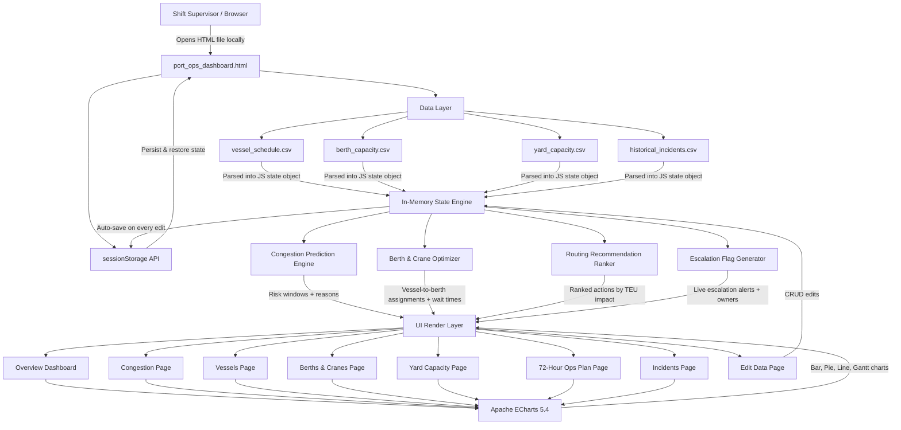

# Architecture

## System Architecture

[Describe the overall architecture of your system. Replace the Mermaid diagram below with your actual architecture.]

## Components

| Component | Technology | Responsibility |
|---|---|---|
| Frontend | [e.g., React 18] | [e.g., Dashboard UI, user interaction] |
| Backend API | [e.g., FastAPI] | [e.g., Business logic, orchestration] |
| AI / ML | [e.g., watsonx.ai] | [e.g., Anomaly scoring, classification] |
| Database | [e.g., PostgreSQL] | [e.g., Storing pipeline events and scores] |
| Notifications | [e.g., Slack API] | [e.g., Alerting on threshold breaches] |

## Data Flow

[Describe how data moves through your system from input to output.]

1. [e.g., Pipeline logs are ingested via a webhook from GitHub Actions]
2. [e.g., Logs are preprocessed and chunked into 512-token segments]
3. [e.g., Each chunk is sent to the watsonx.ai inference endpoint]
4. [e.g., Anomaly scores are stored in PostgreSQL]
5. [e.g., The React dashboard polls the API every 30 seconds to refresh]

## Security Considerations

[Note any security decisions relevant to the architecture — even if basic.]

- [e.g., API keys stored in environment variables, never committed to git]
- [e.g., All API routes require a Bearer token]
- [e.g., Database credentials rotated via IBM Secrets Manager]

## Scalability Notes

[Optional: how would this scale beyond the hackathon prototype?]

[e.g., "The FastAPI backend is stateless and could be horizontally scaled behind a load balancer. The watsonx.ai calls are the bottleneck and would benefit from request batching."]
